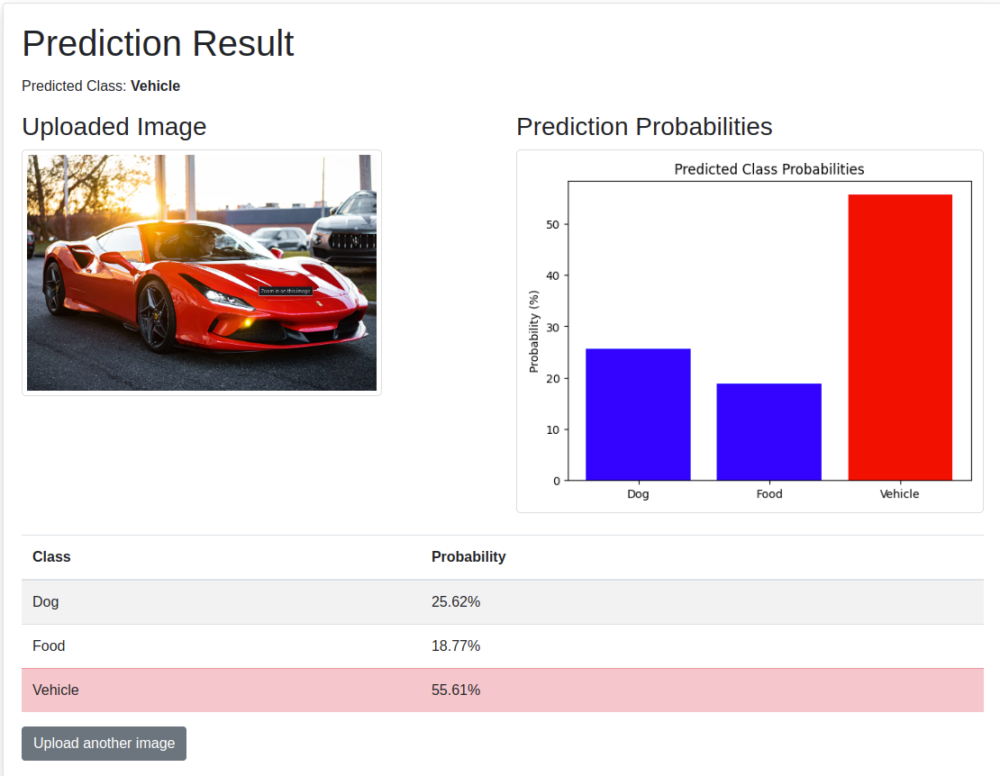

# Dockerized Flask Image Classification App



## Overview

This project is a Dockerized Flask application for image classification using a PyTorch ResNet18 model. The app provides a web interface built with Flask and Jinja templates where users can upload an image. The image is preprocessed (resized to 64x64, converted to a tensor, and normalized to [-1, 1]) before being passed to the model for prediction. The app displays the uploaded image, a bar chart of predicted class probabilities (with the highest highlighted), and the predicted label.

## Features

- **Web Interface:** User-friendly image upload and results display using Flask & Jinja templates.
- **Model Inference:** Uses a serialized PyTorch ResNet18 model for classifying images into three classes: Dog, Food, and Vehicle.
- **Visualization:** Generates a bar chart for class probabilities with the highest probability highlighted.
- **Containerization:** Single Dockerfile to build and run the complete app.
- **CI/CD Pipeline:** GitHub Actions workflow for automatic building, pushing to Docker Hub, and deployment.
- **Deployment:** Easily deployable on free platforms like Render, Fly.io, Railway, or Google Cloud Run.
- **Environment Management:** Uses an environment variable (`MODEL_FILE`) to maintain and update the model version seamlessly.

## Getting Started

### Prerequisites

- [Docker](https://www.docker.com/get-started)
- [Git](https://git-scm.com/)
- (Optional) [GitHub](https://github.com/) account for CI/CD
- (Optional) Docker Hub account for image storage
- (Optional) Render account for deployment

### Local Testing Setup

1. **Clone the Repository:**
   ```bash
   git clone <repository_url>
   cd <repository_directory>
   ```

2. **Install Dependencies:**
   ```bash
   pip install -r requirements.txt
   ```

3. **Set Environment Variables:**

   You can either export the environment variable in your shell:
   ```bash
   export MODEL_FILE=model_latest.pt
   python app.py
   ```

   Or use a `.env` file with [python-dotenv](https://pypi.org/project/python-dotenv/):

   - Create a `.env` file in the project root:
     ```env
     MODEL_FILE=model_latest.pt
     ```

   - Ensure your `app.py` loads it at the top:
     ```python
     from dotenv import load_dotenv
     load_dotenv()
     ```

4. **Run the Application Locally:**
   ```bash
   python app.py
   ```
   Open your browser at `http://localhost:5000` and test the image upload functionality.

### Docker Deployment

1. **Build the Docker Image:**
   ```bash
   docker build -t your_dockerhub_username/flask-app:latest .
   ```

2. **Run the Docker Container:**
   ```bash
   docker run -p 5000:5000 your_dockerhub_username/flask-app:latest
   ```

### GitHub Actions CI/CD

This project includes a GitHub Actions workflow (`.github/workflows/deploy.yml`) that:
- Checks out the repository.
- Builds the Docker image.
- Logs in to Docker Hub and pushes the image.
- Triggers a deployment on Render using a deploy webhook.

#### Setup:

1. **Add Secrets to Your GitHub Repository:**
   - `DOCKERHUB_USERNAME` – Your Docker Hub username.
   - `DOCKERHUB_TOKEN` – Your Docker Hub password or access token.
   - `RENDER_DEPLOY_WEBHOOK` – The webhook URL provided by Render for deployment.

2. **Workflow File:**
   The workflow file automatically builds, pushes, and deploys on every push to the main branch.

### Render Deployment

1. **Create a Render Account:**
   Sign up at [Render](https://render.com) for a free account.

2. **Connect Your GitHub Repository:**
   In Render’s dashboard, create a new Web Service and select your repository.

3. **Configure the Service:**
   - **Environment:** Choose "Docker" as the runtime.
   - **Branch:** Set to `main` (or your preferred branch).
   - **Environment Variables:** Add `MODEL_FILE=model_latest.pt` (or your chosen model filename).
   - **Port Configuration:** Modify your `app.py` so the app listens on the port specified by the `$PORT` environment variable:
     ```python
     if __name__ == "__main__":
         port = int(os.environ.get("PORT", 5000))
         app.run(host="0.0.0.0", port=port)
     ```
4. **Enable Automatic Deployments:**
   Enable automatic deploys in Render, or trigger deployments via the deploy webhook as configured in GitHub Actions.

## Project Structure

```
.
├── app.py                  # Main Flask application
├── model.py                # Model definition and serialization script
├── model_latest.pt         # Serialized PyTorch model
├── Dockerfile              # Docker configuration file
├── requirements.txt        # Python dependencies
├── deploy.sh               # Deployment shell script for triggering webhook deploy
├── .github/
│   └── workflows/
│       └── deploy.yml      # GitHub Actions workflow for CI/CD
├── templates/
│   ├── index.html          # Upload form template
│   └── result.html         # Prediction result template
└── imgs/
    └── demo.png            # Header demo image
```

## License

This project is licensed under the MIT License. See the [LICENSE](LICENSE) file for details.

## Acknowledgments

- [Flask](https://flask.palletsprojects.com/) for the web framework
- [PyTorch](https://pytorch.org/) for model inference
- [Docker](https://www.docker.com/) for containerization
- [Render](https://render.com/), [Fly.io](https://fly.io/), [Railway](https://railway.app/), and [Google Cloud Run](https://cloud.google.com/run) for free deployment options